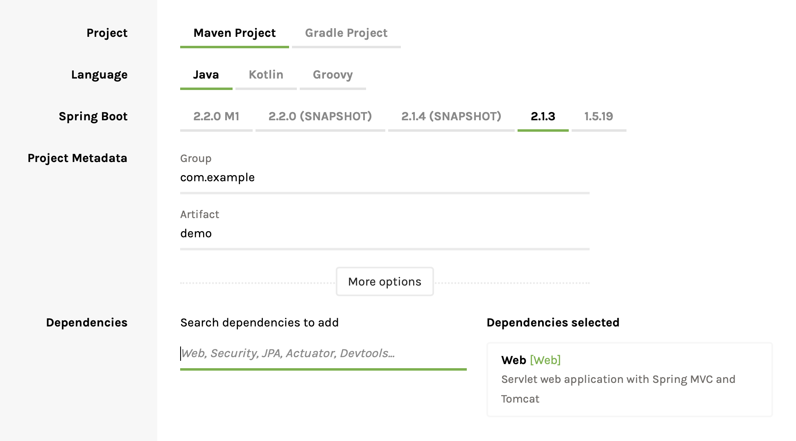
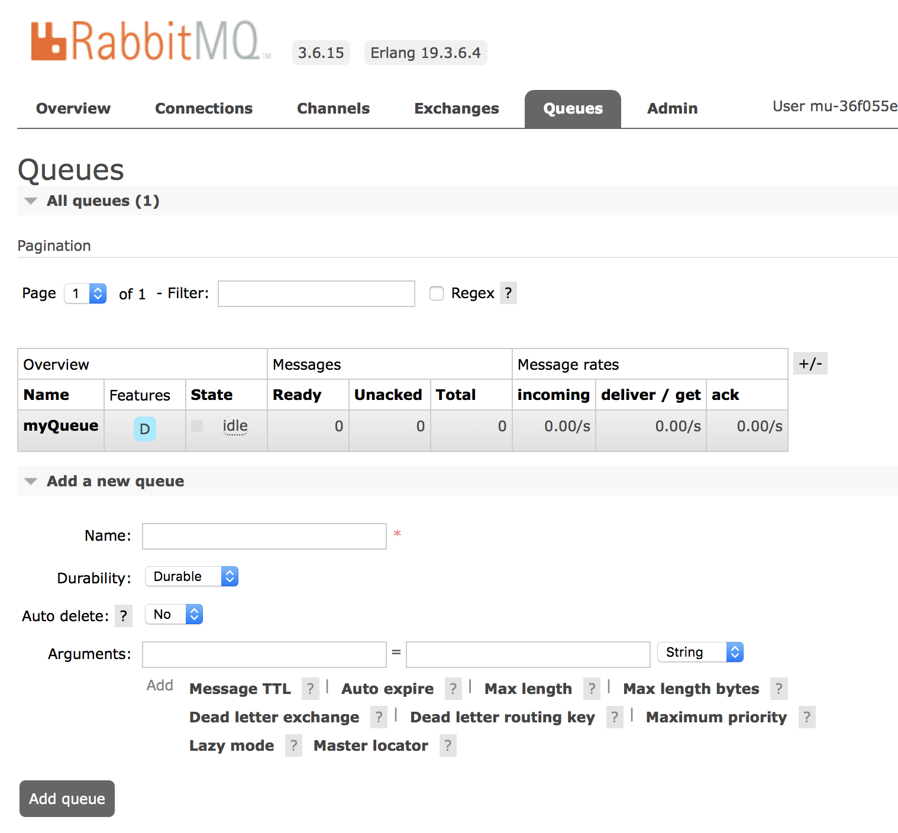

# Cloud Lab

Cloud Native Lab - Simple Workshop demonstrating Cloud-Native development with Spring Boot and Pivotal Cloud Foundry.

# Items covered:

## Spring Boot

* Initializr
* Web
* Actuator
* Profiles
* Cache
* Data
* Data Migration (Flyway)
* Scheduling
* Messages (AMQB)

## PCF

* Deployment
* Scaling / Auto-Scaling
* Self-Healing
* Metrics
* Logging
* Market Place
* MySQL
* Redis
* RabbitMQ


## PCF

## Prerequisites

### Modern Java JDK Installed (at-least Java8)

### Cloud Foundry Command Line Interface (cf CLI) installed

[https://docs.cloudfoundry.org/cf-cli/install-go-cli.html](https://docs.cloudfoundry.org/cf-cli/install-go-cli.html)

### Java IDE of choice ..

Intellij recommended .. The Community addition is free.

### Access to a Pivotal Cloud Foundry instance

Access will be provided during the workshop, or you can sign-up for a free access at : https://run.pivotal.io

## 0 - Initialization

Key points:
* Spring Boot Initializr
* Maven vs Gradle
* Maven Wrapper / Gradle Wrapper

### 0.1 - Generate a Spring Boot Template from https://start.spring.io
Stick to the default settings, however update:
- artifact name to cloud-lab
- for dependencies add *Web*
- select Gradle or Maven Project



Download it, and unzip it.

Note the mvnw or gradlew files:
These are the Wrapper components for Maven and Gradle: ensuring build script version consistency, removing the dependency of having these build tools installed , and simplifying CI build agent dependencies (only a JDK will be required).

### 0.2 - Import the project into your IDE

Note make sure to do an *import* and not just *open* , to allow for your IDE to correctly pull down dependencies.

## 1 - WebApplication with SpringBoot

Key points:
* Spring Boot Web
* Creating a Simple Helloworld endpoint
* Running the App locally
* No XML!

### 1.1 - Implement a HelloWorld endpoint
This can be done by creating a *HelloWorldController* Java class file with:


```java
@RestController
public class HelloWorldController {

    @RequestMapping("hello")
    public String helloWorld(){
        return "Hola Mundo!";
    }
}
```

### 1.2 - Run the application

With Gradle:
```sh
./gradlew bootRun
```

(on windows machines use : gradlew.bat bootRun)

Or you can build the artifact with:

```sh
./gradlew build
```

and then run it directly as a Jar file:

```sh
java -jar build/libs/cloud-lab-0.0.1-SNAPSHOT.jar
```

For maven:

```sh
./mvnw spring-boot:run
```

To build the artifact:

Run:

```sh
./mvnw package
```

```sh
java -jar ./target/cloud-lab-0.0.1-SNAPSHOT.jar
```

Note Tomcat is embedded inside of the build artifact (you don't need an external application Server).

Also note, the different default output directories for Maven and Gradle.

### 1.3 - Test the /hello endpoint
The address will be: localhost:8080/hello

You can test via a browser or commandline:
```sh
curl localhost:8080/hello
```

### 1.4 - BONUS - Add Unit Tests for HelloWorld endpoint
This can be done by creating a *HelloWorldControllerTests* Java class file in the test/java directory with:

```java
@RunWith(SpringRunner.class)
@SpringBootTest(webEnvironment = SpringBootTest.WebEnvironment.RANDOM_PORT)
public class HelloWorldControllerTests {

    @Autowired
    private TestRestTemplate restTemplate;

    @Test
    public void testHelloWorld(){
        String body = restTemplate.getForObject("/hello",String.class);

        assertThat(body).contains("Hola Mundo!");
    }
}
```

With Intellij, you can now run the Test by right clicking on it.

From the commandline you can run them with:

```sh
./gradlew test
```

Note: RestTemplate and TestRestTemplate are the conventional ways for invoking / and testing HTTP/Rest calls.


## 2 - WebApplication on PCF

Key points:
* Deploying to PCF
* Scaling in PCF

### 2.1 - Login into the PCF instance that you are using (if required)

```sh
cf login -a ENTER_API_URL_HERE
```

Enter your Username and Password.

### 2.2 - Deploy your application to PCF

For Gradle:
```sh
cf push cloud-lab -p build/libs/cloud-lab-0.0.1-SNAPSHOT.jar
```
For Maven:
```sh
cf push cloud-lab -p target/cloud-lab-0.0.1-SNAPSHOT.jar
```

This will automatically create a new application in your default PCF development space, with the specific jar artifact deployed.

Note that PCF will automatically detect that this is a Java application, and use the appropriate *BuildPack*.

### 2.3 - Login into the PCF portal to view your newly deployed / created application

If you are using Pivotal Web Services, the portal is at:

https://run.pivotal.io

Click through to your app by selecting the default space and org.

Your route to the application (URL) will be presented besides your application.

### 2.4 - Test the /hello endpoint at this route <ROUTE>/hello

### 2.5 - Scale the App

Either provision more instances or more space.

This can be done via the command line or via the GUI.

To scale up to 2 instances:

```sh
cf scale cloud-lab -i 2
```

Via the GUI observe additional instances being spun up.

## 3 - Operations with Spring Boot

Key points:
* Spring Boot Actuator - including walk-through of available endpoints
* Spring Boot Dependency Management (no need for individual artifact versioning)
* Exposing additional Actuator information
* Build / and GIT information

The Spring Actuator Dependency adds out-of-the-box endpoints for monitoring and interacting with your application.

### 3.1 - Add the Spring Boot Actuator dependency to your build script.

The full name of the dependency is : *org.springframework.boot:spring-boot-starter-actuator*

If using Gradle, your new dependency block should look like:

```groovy
dependencies {
    //...
    compile('org.springframework.boot:spring-boot-starter-actuator')
    //...
}
```

For Maven:

```xml
<dependencies>
    <!-- other dependencies -->

		<dependency>
			<groupId>org.springframework.boot</groupId>
			<artifactId>spring-boot-starter-actuator</artifactId>
		</dependency>

     <!-- other dependencies -->
</dependencies>
```


Re-run the application
```sh
./gradlew bootRun
```

or with Maven:

```sh
./mvnw spring-boot:run
```

### 3.2 - Check the localhost:8080/actuator/health endpoint

Verify that it works on your local running instance of the app:

```sh
curl localhost:8080/actuator/health
```

You can also use a browser

### 3.3 - Expose additional information on the Health Endpoint

To the application.properties file in resources add:

```properties
management.endpoint.health.show-details=ALWAYS
```

Later on in the Workshop this endpoint will also show external dependency status and information (including Data, Cache, and Messaging).

### 3.4 - Check for new information on the health endpoint

This will require running rebuilding the application:

```sh
./gradlew bootRun
```

```sh
curl localhost:8080/actuator/health
```

### 3.5 - Enable ALL Actuator endpoints

Currently exposed actuator endpoints can be viewed at: http://localhost:8080/actuator

For security reasons, many of the these endpoints are turned off by default.

They can be ALL enabled by adding the following to your application.properties file:

```properties
management.endpoints.web.exposure.include=*
```

Rebuild, and check the http://localhost:8080/actuator endpoint for available ones.

### 3.6 - BONUS - Add build information the /info endpoint

We want to be able to easily view build information from running instances of our app.

You will need to generate a META-INF/build-info.properties in your class path .. this can be automated :

Add the following to your build.gradle:

 ```groovy
 springBoot {
    buildInfo()
 }
 ```

Or for Maven in the pom.xml .. update the build block to the following .. note the addition of the executions block:


```xml
<build>
	<plugins>
		<plugin>
			<groupId>org.springframework.boot</groupId>
			<artifactId>spring-boot-maven-plugin</artifactId>
			<executions>
				<execution>
					<goals>
						<goal>build-info</goal>
					</goals>
				</execution>
			</executions>
		</plugin>
	</plugins>
</build>
```

Rebuild, and check the http://localhost:8080/actuator/info endpoint.

### 3.7 - BONUS - Add GIT Information to the /info endpoint

Hint - you will need to init a GIT repo locally, and add the com.gorylenko.gradle-git-properties dependency in Gradle.

For Maven users, the spring-boot-starter-parent POM includes a pre-configured plugin to generate a git.properties file. To use it, add the following declaration to your POM:

```xml
<build>
	<plugins>
		<plugin>
			<groupId>pl.project13.maven</groupId>
			<artifactId>git-commit-id-plugin</artifactId>
		</plugin>
	</plugins>
</build>
```

## 4 - Operations on PCF

Key points:
* Dealing with Crashes
* Metric and Logging
* Auto-Scaling
* Zero down-time deployments

### 4.1 - Add an endpoint to your App to simulate JVM crashes

Add a new KillController with a Kill endpoint/

```java
@RestController
public class KillController {

  @RequestMapping("/kill")
  public void kill(){
      System.exit(1);
  }
}
```

Rebuild your app, and redeploy to PCF.

```sh
 ./gradlew build && cf push cloud-lab -p build/libs/cloud-lab-0.0.1-SNAPSHOT.jar
```

```sh
 ./mvnw package && cf push cloud-lab -p target/cloud-lab-0.0.1-SNAPSHOT.jar
```

### 4.2 - In separate terminal window, TAIL the PCF app logs

```sh
cf logs cloud-lab
```

### 4.3 - Call the /kill endpoint

Note that PCF will automatically bring up a new instance.

This can be monitored from the PCF Dev Portal.

You can also view what happened in the logging window from the previous step.

For additional information, you can also drill down into the *PCF Metrics" option in the Application page in PCF. This includes more in-depth logging, and crash analysis.

### 4.4 - BONUS - Create a PCF manifest to simplify deployments

https://docs.cloudfoundry.org/devguide/deploy-apps/manifest.html

```sh
cf create-app-manifest cloud-lab
```

You can customize deployment settings, as well as default binary path.

### 4.5 - BONUS - Add Auto-Scaling to Your Application

https://docs.run.pivotal.io/appsman-services/autoscaler/using-autoscaler.html

### 4.6 - BONUS - Perform a Blue-Green Deployment to Reduce Downtime and Risk

Blue-green deployment is a technique that reduces downtime and risk by running two identical production environments called Blue and Green.

At any time, only one of the environments is live, with the live environment serving all production traffic. For this example, Blue is currently live and Green is idle.

#### 4.6.1 - BONUS - Deploy a new instance of our cloud-lab

```sh
cf push cloud-lab-2 -p build/libs/cloud-lab-0.0.1-SNAPSHOT.jar
```

Right now, we have 2 deploys apps running (they can be different version of the application).

#### 4.6.2 - Route all cloud-lab subdomain traffic to cloud-lab2 (in addition to our original cloud-lab instance).

For reference, current Routes can be viewed with:

```sh
cf routes
```

Note the domain used for your cloud-lab apps.

Route cloud-lab subdomain traffic to cloud-lab:

```sh
 cf map-route cloud-lab-2 ENTER_PCF_DOMAIN --hostname cloud-lab
```

**Replace ENTER_PCF_DOMAIN with domain from *cf routes* step.**

##### 4.6.3 - Unmap cloud-lab traffic to the cloud-lab subdomain

```
cf unmap-route cloud-lab ENTER_PCF_DOMAIN --hostname cloud-lab
```

Note, all cloud-lab subdomain traffic will now be mapped to our recent deploy.

**Replace ENTER_PCF_DOMAIN with domain from *cf routes* step.**

Cloud Foundry community members have written plugins to further automate the blue-green deployment process. These include:

Autopilot: Autopilot is a Cloud Foundry Go plugin that provides a subcommand, zero-downtime-push, for hands-off, zero-downtime application deploys.
BlueGreenDeploy: cf-blue-green-deploy is a plugin, written in Go, for the Cloud Foundry Command Line Interface (cf CLI) that automates a few steps involved in zero-downtime deploys.


## 5 - Configuration with Spring Boot

Key points:
* Spring Boot Profiles
* Configuration precedence

Spring Boot lets you externalize your configuration so that you can work with the same application code in different environments.

https://docs.spring.io/spring-boot/docs/current/reference/html/boot-features-external-config.html

### 5.1 - Allow injection of the helloWorld message via external sources
```java
@RestController
public class HelloWorldController {

    @Value("${helloworld.message:'Hola Mundo - default!'}")
    private String helloMessage;

    @RequestMapping("hello")
    public String helloWorld(){
        return helloMessage;
    }
}
```

Note #1 : the usage of the default value in case nothing is found (optional).

Note #2 : You may have to fix broken tests!!

### 5.2 - Add a configurable value for helloworld.message in the application.properties file.

```properties
helloworld.message="Hello World - default config file"
```

### 5.3 - Rebuild / Restart your app, and verify the /hello endpoint.

Default should be "Hello World - default config file"

## 6 - Configuration on PCF

Key points:
* The cloud profile
* Spring Cloud Config Server overview

### 6.1 - Add a custom HelloWorld message for cloud deployments

PCF deploys will automatically load *cloud* profile settings.

In the resources folder, add a *application-cloud.properties* file.

Add:

```properties
helloworld.message="Hello World - cloud only"
```

Build and Redeploy to PCF.

Verify the updated message at the /hello endpoint.

Note: You can also use the Spring Config Server (available as a Service in the MarketPlace) to inject properties from an external source such as a GitHub repo.

## 7 - Caching with Spring Boot

Key points:
* Spring Boot Cache
* The Cacheable annotation

### 7.1 - Add a slow , costly endpoint to the Application.

One example would be performing an uppercase operation on a String with a time delay.

```java
@RestController
public class CacheExampleController {

  @RequestMapping("/uppercase")
  public String uppercase(String input ){
      try {Thread.sleep(5000); } catch (InterruptedException e) {}

      return input.toUpperCase();
  }
}
```

Rebuild, rerun the app.

From the browser you can call : *http://localhost:8080/uppercase?input=test*

Or using curl:

```sh
curl http://localhost:8080/uppercase?input=test
```

Note how the /uppercase endpoint is always slow.

### 7.2 - Add the Spring Boot Cache dependency to your build script.

The full name of the dependency is : *org.springframework.boot:spring-boot-starter-cache*

If using Gradle, your new dependency block should look like:

```groovy
dependencies {
    //...
    compile('org.springframework.boot:spring-boot-starter-cache')
    //...
}
```

### 7.3 - Enable Caching on the endpoint by using the *Cacheable* Annotation.

Updated CacheExampleController should look like:

```java
@Cacheable("uppercase")
@RequestMapping("/uppercase")
public String uppercase(String input ){
    try {Thread.sleep(5000); } catch (InterruptedException e) {}

    return input.toUpperCase();
}
```

You will also need to turn on Caching (app wide) by adding the EnableCaching annotation to your app.

This can be done in the CloudLabApplication class:

```java
@SpringBootApplication
@EnableCaching
public class CloudLabApplication {

	public static void main(String[] args) {
		SpringApplication.run(CloudLabApplication.class, args);
	}
}
```

Restart your app, and verify that subsequent calls to the endpoint return much quicker.

Note, the default cache implementation uses local in-memory caching, but this can be easily change to use 3rd party caching solutions such as Redis.

### 7.4 - BONUS - Add an eviction endpoint to the controller

Given a String, evict it from the Cache.

Hint: CacheEvict annotation

## 8 - Caching on PCF

Key points:
* Spring Boot Redis
* CF MarketPlace / Service Broker
* Binding Services to App Instances
* Creating a Redis Instance in PCF


### 8.1 - Add the Spring Boot Redis and commons-pool dependencies to your build script.

If using Gradle, your new dependency block should look like:

```groovy
dependencies {
    //...
    compile('org.springframework.boot:spring-boot-starter-data-redis')
    compile('org.apache.commons:commons-pool2')
    //...
}
```

Rebuild, and redeploy to PCF.

### 8.2 - Create a Redis Service Instance in PCF

You can view available self-self / on-demand provisioning services via the marketplace.

```sh
cf marketplace
```

To create a Redis Service run:

```sh
cf create-service p-redis shared-vm custom-redis
```

### 8.3 - Bind the Service to our application

```sh
cf bind-service cloud-lab custom-redis
```

Restage your app:
```sh
cf restage cloud-lab
```

Confirm connection to your Redis Server using the health endpoint: /actuator/health

Also confirm that cache is still working.

### 8.4 - BONUS - Default to Simple (non-Redis caching locally) and Redis Caching in the cloud

In application.properties add:

```properties
spring.cache.type=SIMPLE
```

In application-cloud.properties add:

```properties
spring.cache.type=REDIS
```

Verify that Caching works locally and in PCF.

## 9 - Data with Spring Boot

Key points:
* Spring Boot Data / Rest
* Auto-generated Rest Compliant endpoints for Entity Domain Objects
* Default Data using import.sql
* Project Lombok

### 9.1 - Add the Spring Boot Data JPA , Rest and H2Database dependencies to your build script.

The full name of the dependencies are :
*org.springframework.boot:spring-boot-starter-data-jpa*
*org.springframework.boot:spring-boot-starter-data-rest*
*com.h2database:h2*

If using Gradle, your new dependency block should look like:

```groovy
dependencies {
	//...
	compile('org.springframework.boot:spring-boot-starter-data-rest')
	compile('org.springframework.boot:spring-boot-starter-data-jpa')
	compile('com.h2database:h2')
	//...
}
```

### 9.2 - Add a Simple Domain Object

One example would be a Person object with First and Last names variables.

```java
@Entity
public class Person {

    @Id
    @GeneratedValue(strategy = GenerationType.AUTO)
    private long id;

    private String firstName;
    private String lastName;

    public String getFirstName() {
        return firstName;
    }

    public void setFirstName(String firstName) {
        this.firstName = firstName;
    }

    public String getLastName() {
        return lastName;
    }

    public void setLastName(String lastName) {
        this.lastName = lastName;
    }
}

```

### 9.3 - Add a Repository Interface

Also create a PersonRepository interface:

```java
public interface PersonRepository extends JpaRepository<Person, Long> {}

```

### 9.4  - Add Default Sample Data

Create a import.sql file in the resources/ directory.

```sql
INSERT INTO PERSON(id, first_name, last_name) VALUES (1, 'Tony', 'Stark');
INSERT INTO PERSON(id, first_name, last_name) VALUES (2, 'Steve', 'Rogers');

```


### 9.5 - Test the new persons endpoints

Restart your app, and view the localhost:8080/persons.

The default is configured to use the embedded H2 Database.

Note how the Interface / and Entity Object were sufficient for Spring Boot to generate Rest compliant endpoints with fully implemented database calls.

Note, the default data implementation uses a local in-memory storage (H2), but this can be easily changed to something else like MySQL.

### 9.6 - BONUS - Enable logging of all DML/DDL SQL statements

Add the following to the *applications.properties* file.

```properties
spring.jpa.show-sql=true
```

Restart your app, you should now see all SQL statement in the log output.

This can be useful in identifying what actual SQL calls Spring Data is making.

### 9.7 - BONUS - Simplify the Person Entity class by auto-generating Getters/Setters.

Hint - Add the Lombok dependency , and use the Data annotation.

Project Lombok is a java library that automatically plugs into your editor and build tools to can reduce Java Boiler Plate code in a number if ways including: Getter/Setter generation, Builder Pattern implementation, Checked Exception handling, and Resource Management.

Full list of features are available at:

https://projectlombok.org/features/all

## 10 - Data on PCF

Key points:
* MySQL Connector
* Creating a MySQL Instance in PCF

### 10.1 - Add the MySQL dependency to the build script.

The full name of the dependency is :
*mysql:mysql-connector-java*

If using Gradle, your new dependency block should look like:

```groovy
dependencies {
    //...
    compile("mysql:mysql-connector-java")
    //...
}
```

### 10.2 - Create a MySql Service Instance in PCF

You can view available self-self / on-demand provisioning services via the marketplace.

```sh
cf marketplace
```

To create a MySQL Service run:

```sh
cf create-service p-mysql 100mb custom-mysql
```

### 10.3 - Bind the Service to our application

```sh
cf bind-service cloud-lab custom-mysql
```

Restage your app:
```sh
cf restage cloud-lab
```

Confirm connection to your MySQL Server using the health endpoint: /actuator/health

Try to hit the /persons endpoint.

It won't work as the database used does not have the required Persons tables created.

Where as with local H2 database usage (from the previous) step, Spring Boot auto-generates (from scratch) the necessary tables schemas each time the app is run. With a long-lived / externalized / and shared database (such as MySQL) , we need a better strategy for keeping database schemas up-to-date.


## 11 - Database Migrations

Key points:
* High-level Database Migration Versioning Tools

Spring Boot supports two higher-level migration tools: Flyway and Liquibase.

We will use Flyway for performing MySQL migrations.

### 11.1 - Add the FlyAwayDB dependency to your build script:

The full name of the dependency is :
*org.flywaydb:flyway-core*

If using Gradle, your new dependency block should look like:

```groovy
dependencies {
	//...
	compile("org.flywaydb:flyway-core")
	//...
}
```

### 11.2 - Add a Base Database Init Script:

In the resources folder , create a db/migration sub-folder.

In it create a V1__init.sql file (resources/db/migration/V1__init.sql).

Add the following to it:

```sql
CREATE TABLE PERSON (
	id int NOT NULL AUTO_INCREMENT,
	first_name varchar(255) not null,
	last_name varchar(255) not null,
	PRIMARY KEY (ID)
);

INSERT INTO PERSON (first_name, last_name) VALUES ('Peter', 'Parker');
```

### 11.3 - Rebuild and redeploy to PCF

You can look at http://localhost:8080/actuator/flyway to review the list of scripts.

FlyAway will only apply updates as needed, and keeps track of scripts run (in the flyway_schema_history table).

### 11.4 - BONUS - Add a middleName value to the Person Object , and create Database Migration scripts for this

```java
    private String middleName;

    public String getMiddleName() {
        return middleName;
    }

    public void setMiddleName(String middleName) {
        this.middleName = middleName;
    }
```

Create a V2__person_middle_name_addition.sql file (in db/migration).

Add the following to it:

```sql
ALTER TABLE person ADD middle_name varchar(255);
```

Build and redeploy to PCF.

Flyway will automatically upgrade the Database Schema version to v2.

### 11.5 - BONUS - Add caching to a database lookup call

Hint: Add a method definition with a Caching annotation to the PersonRepository interface.

### 11.6 - BONUS - Deploy the PivotalMySQLWeb App into PCF to view the flyway_schema_history schema / and row values.

App can be downloaded from:

https://github.com/pivotal-cf/PivotalMySQLWeb

It will also need to be bound to your MySQL instance.

## 12 - Scheduling with Spring Boot

### 12.1 - Enable Scheduling in your Spring Boot Application

You will also need to turn on Scheduling (app wide) by adding the EnableScheduling annotation to your app.

This can be done in the CloudLabApplication file:

```java
@SpringBootApplication
@EnableCaching
@EnableScheduling
public class CloudLabApplication {

    public static void main(String[] args) {
        SpringApplication.run(CloudLabApplication.class, args);
    }
}
```

EnableScheduling ensures that a background task executor is created. Without it, nothing gets scheduled.

### 12.2 - Create a Simple Task to be executed every 5 seconds

Our example will display the time:

```java
@Component
public class ScheduledTasks {

    private static final Logger log = LoggerFactory.getLogger(ScheduledTasks.class);

    private static final SimpleDateFormat dateFormat = new SimpleDateFormat("HH:mm:ss");

    @Scheduled(fixedRate = 5000)
    public void reportCurrentTime() {
        log.info("The time is now {}", dateFormat.format(new Date()));
    }
}
```

Restart your app.

```sh
./gradlew bootRun
```

Note the additional time messages in the output.

Other options exist for scheduling tasks and can be seen at :
https://docs.spring.io/spring/docs/current/spring-framework-reference/integration.html#scheduling

### 12.3 - View currently scheduled tasks by hitting the scheduledtasks endpoint

http://localhost:8080/actuator/scheduledtasks

## 13 - Messaging with Spring Boot

Key points:
* Spring Boot AMQP
* Sending and Receiving Messages

### 13.1 - Add the Spring Boot AMQP dependency to your build script.

The full name of the dependency is : *org.springframework.boot:spring-boot-starter-amqp*

If using Gradle, your new dependency block should look like:

```groovy
dependencies {
    //...
    compile('org.springframework.boot:spring-boot-starter-amqp')
    //...
}
```

### 13.2 - Create a Controller for Sending and Receiving Queue Messages

In a new QueueController java file , add:

```java
@RestController
public class QueueController {

    @Autowired
    private AmqpTemplate amqpTemplate;

    @RequestMapping("/sendmessage")
    public void sendMessage(String input){
        amqpTemplate.convertAndSend("myQueue",input);
    }

    @RequestMapping("/getmessage")
    public String getMessage(){
        Message message = amqpTemplate.receive("myQueue");
        if(message == null)
            return "Queue empty";

        return message.toString();
    }
}

```

This will send messages to the default the "Default" exchange, with the "myQueue" routing key.

*For purpose of workship, unlike Caching / Data , we will go directly to testing in PCF*

If do have a local instance of RabbitMQ, you can point to it by updating your application properties with the correct connection settings:

application.properties
```properties
spring.rabbitmq.host = 127.0.0.1
spring.rabbitmq.port = 5672
spring.rabbitmq.username = guest
spring.rabbitmq.password = guest
```

Your RabbitMQ instance will need to have a queue create called **myQueue**. Messages sent to the Default exchange with the **myQueue** routingkey will be automatically routed to the **myQueue** queue.

## 14 - Messaging on PCF

Key points:
* Creating a RabbitMQ Instance in PCF

### 14.1 - Create a RabbitMQ Service Instance in PCF

You can view available self-self / on-demand provisioning services via the marketplace.

```sh
cf marketplace
```

To create a RabbitMQ Service run:

```sh
cf create-service p-rabbitmq standard custom-rabbitmq
```

### 14.2 - Bind the Service to your application

```sh
cf bind-service cloud-lab custom-rabbitmq
```

### 14.3 - Add the *myQueue* queue to your RabbitMQ instance

In the PCF Dev Portal:

In your DevSpace, select your RabbitMQ instance, and click Manage.

This will pull up the RabbitMQ control GUI.



Under the Queues tab, select add a new queue.

Call it "myQueue".

The Default Exchange will route to specific queues based on specified routing key.

Confirm connection to your RabbitMQ Server using the health endpoint: /actuator/health

Rebuild and deploy your app to PCF , with the changes from the previous step.


### 14.4 - Test messaging using the /getmessage and /sendmessage endpoints.

To send message, curl or point your browser to /sendmessage?input=YOUR_MESSAGE_STRING

To receive messages, curl or point your browser to /getmessage

## 15 - Spring Cloud

**Discussion Item**

Spring Cloud provides tools for developers to quickly build some of the common patterns in distributed systems (e.g. configuration management, service discovery, circuit breakers, intelligent routing, micro-proxy, control bus, one-time tokens, global locks, leadership election, distributed sessions, cluster state). Coordination of distributed systems leads to boiler plate patterns, and using Spring Cloud developers can quickly stand up services and applications that implement those patterns. They will work well in any distributed environment, including the developer's own laptop, bare metal data centres, and managed platforms such as Cloud Foundry.

### 15.1 - Spring Cloud Config

Centralized external configuration management backed by a git repository. The configuration resources map directly to Spring `Environment` but could be used by non-Spring applications if desired.

### 15.2 - Spring Cloud NetFlix

Integration with various Netflix OSS components (Eureka, Hystrix, Zuul, Archaius, etc.).